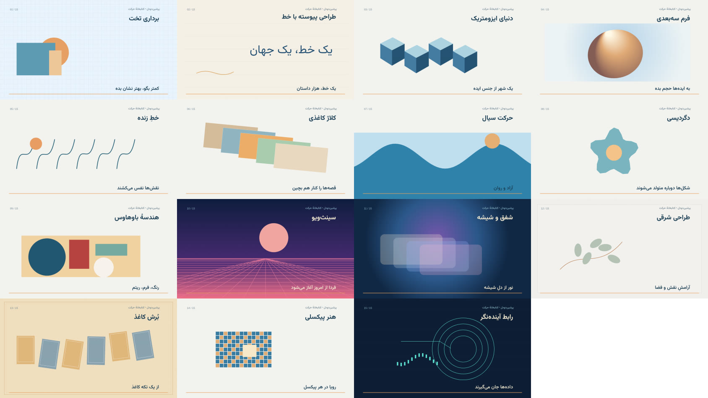
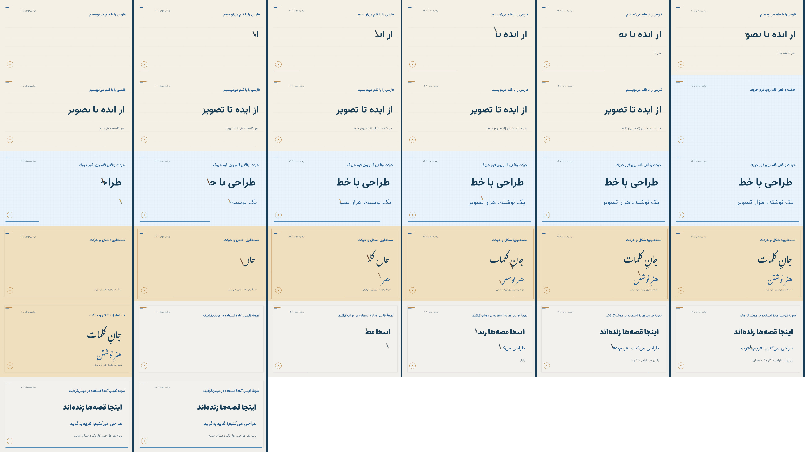

<div align="center">

# پرشین‌دودل | PersianDoodle

**استودیوی متن، حرکت و صدا با پشتیبانی واقعی از فارسی**

[**🎬 ورود به کتابخانهٔ آنلاین**](https://ambplus.github.io/persiandoodle/library/) · [تماشای ۱۵ سبک فارسی](assets/library/persian-motion-styles.mp4) · [دیدن خطاطی فارسی](assets/persian/handwriting-demo.mp4) · [راهنمای تولید](library/prompts/PERSIAN-MOTION-DIRECTOR.md)



</div>

## کتابخانهٔ طراحی و موشن

[**کتابخانهٔ آنلاین پرشین‌دودل ↗**](https://ambplus.github.io/persiandoodle/library/)

یک محیط فارسی برای جست‌وجو در سبک‌ها، شات‌ها، تایپوگرافی، موسیقی، صدا، فونت، پس‌زمینه و افکت‌های انیمیشن. هر کارت دارای توضیح فارسی، منبع، وضعیت مجوز، پیش‌نمایش طراحی‌شده با فارسی و امکان افزودن به ترکیب صحنه است.

- **۱۵ سبک موشن** در قالب صحنه‌های مستقل با نوشتهٔ فارسی رندر شده‌اند؛ برای هر سبک ویدیو و تصویر جداگانه داریم.
- کتابخانهٔ گسترده‌تر شامل صدها مرجع و دستور ساخت است؛ برای هر مورد یک پیش‌نمایش مفهومی فارسی تولید می‌شود، اما آن را با پیاده‌سازی کامل افکت مرجع اشتباه نمی‌گیریم.
- پرامپت‌های اصلی قابل‌بازتوزیع نگهداری می‌شوند؛ **۱۰ دستور آمادهٔ ترکیب** و یک راهنمای کارگردانی فارسی هم وجود دارد.
- پنج پس‌زمینه، پنج مدل قلم و صدای همگام با حرکت قلم در موتور اصلی قابل‌استفاده‌اند.

## ساخت صحنه با چند انتخاب

در [Library](https://ambplus.github.io/persiandoodle/library/) روی کارت‌های موردنظرت **«افزودن به صحنه»** بزن. می‌توانی سبک هنری، تایپوگرافی، پس‌زمینه، مدل قلم، نوع ظاهرشدن متن، حرکت، ترنزیشن و صدا را ترکیب کنی.

در پایان «دریافت مشخصات JSON»، «کپی JSON برای ساخت آنلاین» یا «کپی دستور ساخت فارسی» را انتخاب کن. برای ساخت بدون نصب محلی، [**رندر آنلاین با GitHub Actions**](https://github.com/AmBplus/persiandoodle/actions/workflows/render-scene.yml) را باز کن، روی **Run workflow** بزن، JSON کپی‌شده را در فیلد `scene_json` قرار بده و فایل MP4 و فریم‌ها را از قسمت Artifacts همان اجرا بگیر. این فایل شناسهٔ هر جزء و وضعیت واقعی پیاده‌سازی را نگه می‌دارد. اگر یک جزء فقط مرجع باشد، پیش از تولید کامل باید یک پیاده‌سازی مستقل برای آن نوشته شود.

برای نمونه‌های قابل‌اجرای موتور:

```bash
cd skills/anidoodle/engine
npm ci
npx playwright-core install chromium

# نمایش ۱۵ سبک به فارسی
node tools/persian-qa.mjs
node tools/render.mjs persianMotionSampler --out out/persian-motion-styles.mp4

# خروجی صحنه انتخاب‌شده از JSON دانلودشده
node tools/render-library-scene.mjs --config /path/to/persiandoodle-scene.json
# برای ترکیب‌هایی که هنوز شامل تکنیک مرجعِ پیاده‌سازی‌نشده‌اند:
node tools/render-library-scene.mjs --config /path/to/persiandoodle-scene.json --allow-concept
```

خروجی ابزار، **ویدیوی MP4 و مشبک فریم‌های کنترل کیفیت** است. گزینهٔ `--allow-concept` یک بازآفرینی مفهومی تولید می‌کند و به معنی پیاده‌سازی کامل همهٔ کارت‌های خارجی نیست.

برای نمایش کتابخانه روی سیستم محلی:

```bash
python3 -m http.server 8080
# http://localhost:8080/library/
```

## تایپوگرافی و خطاطی فارسی

نوشتن فارسی، اتصال حروف، نیم‌فاصله، شکل درست «ی» و «ک»، نقطه‌ها و زمان رسیدن قلم به جوهر در موتور پشتیبانی می‌شود. ۲۵ خانوادهٔ فونت آزاد نصب شده‌اند و با ذکر مجوز اصلی هرکدام استفاده می‌شوند. صدای تماس قلم با کاغذ نیز می‌تواند از همان تایم‌لاین فریم‌های نوشتن ساخته شود.



## معماری و حقوق استفاده

هستهٔ اصلی Anidoodle حفظ شده و کتابخانه، پرامپت‌ها، نماهای فارسی و ابزار ترکیب به‌صورت ماژول‌های مستقل به آن اضافه شده‌اند. منابع الهام و مطالعه عبارت‌اند از [video-shotcraft](https://github.com/Vincentwei1021/video-shotcraft)، [mg-styles-15](https://github.com/Vincentwei1021/mg-styles-15)، [anything2explainer](https://github.com/Vincentwei1021/anything2explainer)، [video-talkcraft](https://github.com/Vincentwei1021/video-talkcraft) و [onetake](https://github.com/feitangyuan/onetake).

**توجه به مجوز:** بعضی منابع فقط برای استفادهٔ غیرتجاری مجوز دارند؛ بنابراین سورس یا محتوای دارای محدودیتشان به پروژه منتقل نشده است. فایل‌های اصلی موسیقی و صدا نیز باید بر اساس مجوز اختصاصی خود بررسی شوند. برای جزئیات، [معماری کتابخانه](docs/MOTION-LIBRARY-ARCHITECTURE.md)، [راهنمای موتور نوشتن فارسی](docs/PERSIAN-INK-ENGINE.md) و [مجوز فونت‌ها](docs/PERSIAN-TYPOGRAPHY.md) را ببین.

مبنای موتور تصویرسازی اولیه: [anidoodle اثر Alex Greenshpun](https://github.com/alexgreensh/anidoodle) (Apache-2.0). مجوزهای سورس و دارایی‌ها در پوشه‌های مربوطه حفظ شده‌اند.
